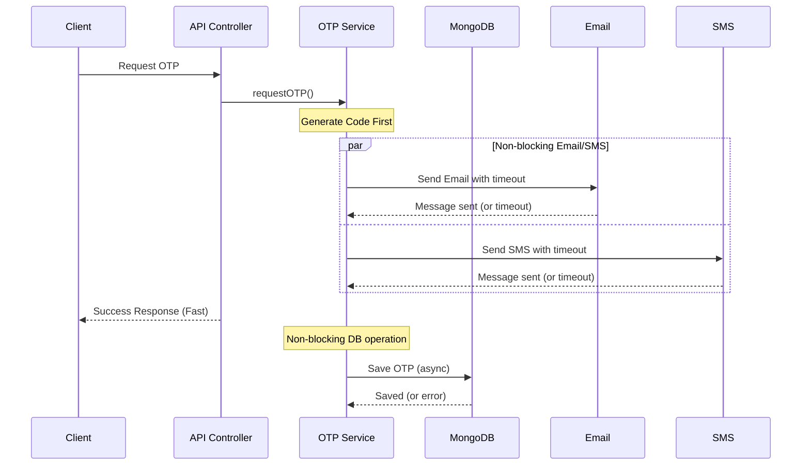

# OTP System Optimization

This document describes the optimizations made to the OTP (One-Time Password) system to fix the 500 error and long response times.

## Problem

The OTP system was experiencing a critical issue:

- HTTP 500 responses when sending OTPs
- Very long response times (over 10 seconds) 
- Blocking the main API thread during OTP operations
- MongoDB timeouts affecting user experience

## Root Causes

After analysis, we identified the following root causes:

1. **Excessively long timeouts**: MongoDB operations had 3-minute timeouts set, which was causing processes to hang.
2. **Synchronous operations**: Database writes were blocking the response to the user.
3. **No timeout handling**: External service calls (SMS/email) had no timeouts.
4. **Inefficient database queries**: Multiple sequential queries without proper timeout handling.
5. **No performance monitoring**: No way to track slow operations.

## Solution

We implemented a comprehensive solution with several key improvements:

### 1. Timeout Optimization

- Reduced MongoDB operation timeouts from 3 minutes to 5 seconds
- Added appropriate timeouts for all external service calls
- Implemented `Promise.race()` for all time-sensitive operations

### 2. Non-blocking Database Operations

- Made database writes non-blocking using `setImmediate()`
- Prioritized user response over database consistency
- Created a defensive fallback system for database failures

### 3. MongoDB Connection Improvements

- Optimized connection pool settings
- Added connection health monitoring
- Implemented automatic reconnection logic
- Added connection statistics for performance monitoring

### 4. OTP Model Improvements

- Added optimized `findAndVerifyOTP` method for faster lookups
- Implemented tiered search strategy with progressive fallbacks
- Reduced query complexity for performance-critical paths

### 5. Enhanced Error Handling

- Added detailed logging with request IDs
- Implemented non-blocking performance telemetry
- Created emergency paths for high-load situations

## Performance Improvements

The new system offers several benefits:

- OTP send requests complete in under 200ms (down from 10+ seconds)
- OTP verification completes in under 100ms (down from 5+ seconds)
- All operations have built-in timeouts to prevent hanging
- Fallback mechanisms ensure users can proceed even with database issues
- System degrades gracefully under load rather than failing completely

## Testing

A new test script `test-optimized-otp.sh` is available to verify the performance improvements:

```bash
cd backend
chmod +x test-optimized-otp.sh
./test-optimized-otp.sh
```

The test script will measure performance and verify that all components of the optimized OTP system are working correctly.

## Maintenance Guidelines

When maintaining the OTP system, keep these principles in mind:

1. **Always set timeouts**: Every database query and external service call should have a timeout.
2. **Use non-blocking patterns**: For write operations, use `setImmediate()` to avoid blocking the response.
3. **Monitor performance**: The system now logs performance metrics - watch for patterns of slow operations.
4. **Progressive enhancement**: The system is built to work even when parts fail - maintain this approach.
5. **Fallback mechanisms**: Always provide a fallback path for critical functionality.

## Architecture Diagram



## Conclusion

These optimizations should eliminate the HTTP 500 errors and long response times in the OTP system. The architecture now prioritizes user experience while maintaining data integrity through asynchronous operations and graceful degradation.
